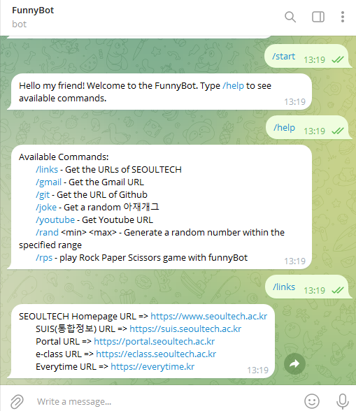
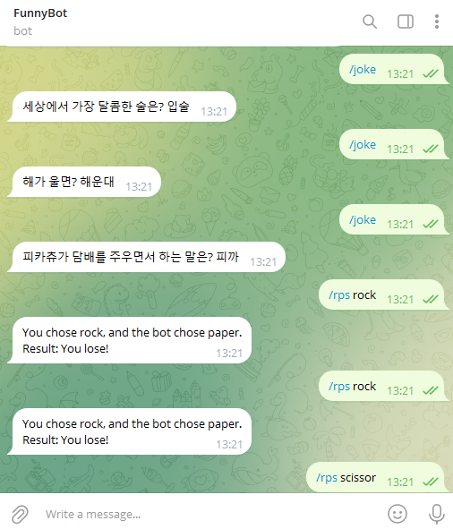

# OpenSource

### ➰ Term Project Proposal

**Computer Science  21101209**
  
# Telegram Bot Explanation

This Python script utilizes the `python-telegram-bot==13.7` (in VScode: pip install python-telegram-bot==13.7) library to create a Telegram bot named FunnyBot. The bot responds to various commands and provides information, jokes, and games.

## Commands

- `/start`: Welcomes the user to the FunnyBot.
- `/help`: Displays available commands and their descriptions.
- `/links`: Provides URLs related to SEOULTECH.
- `/gmail`: Provides a link to Gmail.
- `/git`: Provides a link to GitHub.
- `/youtube`: Provides a link to YouTube.
- `/joke`: Generates and shares a random 아재개그 (Korean dad joke).
- `/rand <min> <max>`: Generates a random number within the specified range.
- `/rps <choice>`: Plays Rock, Paper, Scissors with the bot.

## Functions

- `start(update, context)`: Sends a welcome message when the user starts interacting with the bot.
- `help(update, context)`: Provides help by listing available commands and their descriptions.
- `links(update, context)`, `gmail_url(update, context)`, `youtube_url(update, context)`, `git_url(update, context)`: Respond with specific URLs.
- `get_random_joke()`: Returns a random 아재개그.
- `joke(update, context)`: Sends a random 아재개그 in response to the `/joke` command.
- `random_number_generator(update, context)`: Generates a random number within a specified range in response to the `/rand` command.
- `play_rps(update, context)`: Plays Rock, Paper, Scissors with the user in response to the `/rps` command.
- `determine_winner(player_choice, bot_choice)`: Determines the winner in the Rock, Paper, Scissors game.

## Error Handling

- The script includes basic error handling to ensure proper command usage and parameter inputs.

## License

This script is provided under the [MIT License](LICENSE). You are free to use, modify, and distribute the code. See the [LICENSE](LICENSE) file for details.

## References

- [python-telegram-bot Library](https://python-telegram-bot.readthedocs.io/)
- [GeeksforGeeks](https://www.geeksforgeeks.org/)

## Usage

1. The bot responds to commands entered by users in a Telegram chat.
2. Users can interact with the bot to receive URLs, jokes, random numbers, and play games.

